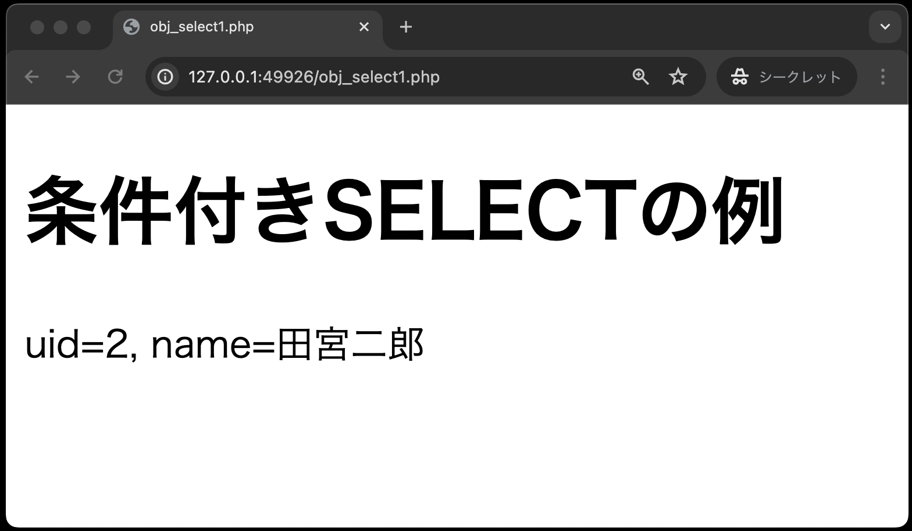
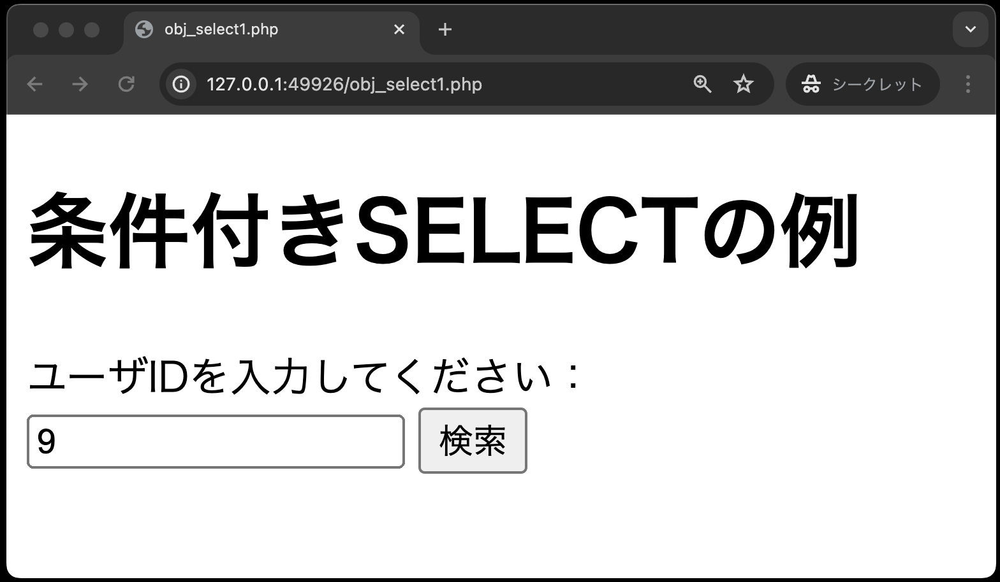
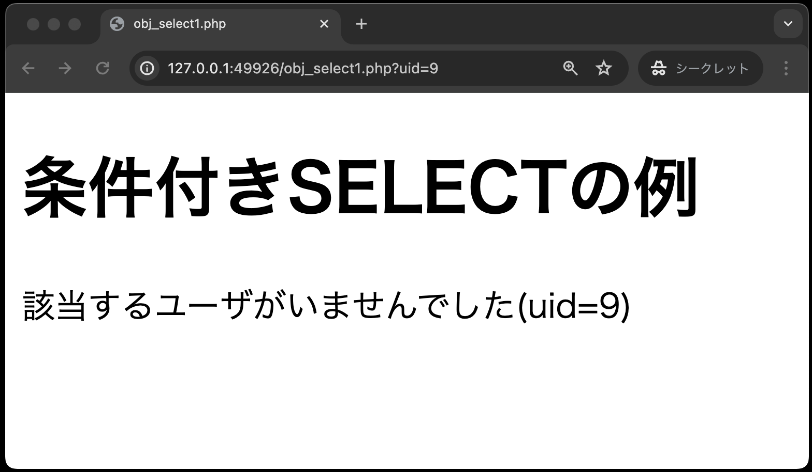
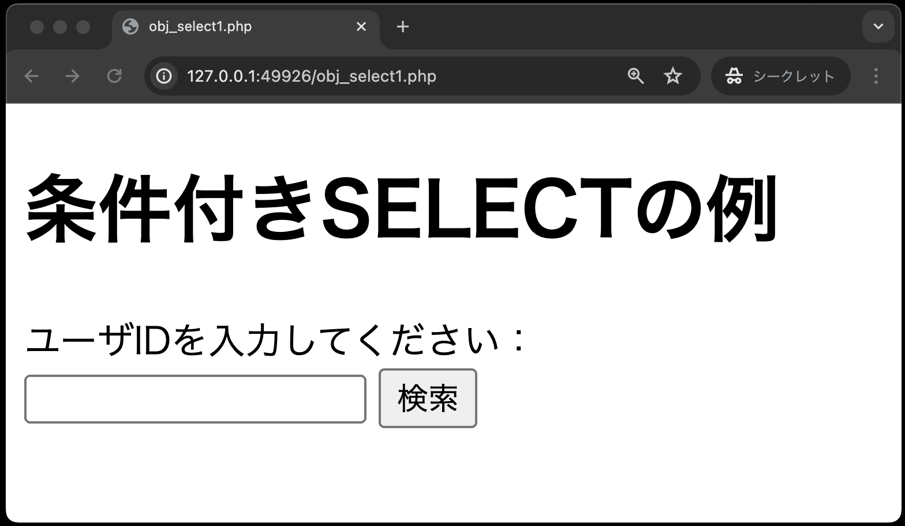
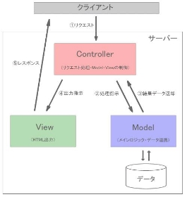

# 課題について

この課題では前章で作成したクラス`DbPhp`を利用するphpファイルのコードを以下に示します。

## 条件付きSELECT文


```php
<!DOCTYPE html>
<html lang="ja">

<head>
    <meta charset="UTF-8">
    <meta name="viewport" content="width=device-width, initial-scale=1.0">
    <title>obj_select1.php</title>
</head>

<body>
    <h1>条件付きSELECTの例</h1>
    <?php
    // (穴埋め)もしも送られてきたuidのデータが空なら、uidを求めるフォームを表示
    if (                    ) {
    ?>
        <form action="dbselect1.php" method="POST">
            <input type="text" name="uid">
            <input type="submit" value="検索">
        </form>
    <?php
    } else {
        // (穴埋め)uidをキーにして、受け取ったuidを代入
        $uid = 

        // (穴埋め)DbPhpクラスのオブジェクト生成し、selectPerson( )メソッドをよびだす
        


        // (穴埋め)抽出した結果に応じた画面を表示する
        // 結果が空ならば、該当するユーザがいない旨を表示
        if (           ) {
            echo 
        } else {
            // (穴埋め)結果があれば、uidとnameを表示
            echo 
        }
    }
    ?>
</body>

</html>
```

1. `person`テーブルにデータのあるユーザーIDを入力し、「検索」ボタンを押した時<br>
→該当する`uid`と`name`が表示される



1. `person`テーブルにデータのないユーザーIDを入力し、「検索」ボタンを押した時<br>
→該当するデータが無い旨のメッセージが表示される



1. ユーザーIDを入力せず、「検索」ボタンを押した時<br>
→検索フォームが表示のまま



## 【まとめ】オブジェクト指向プログラミングのメリット

オブジェクト指向プログラミングのメリットは、**複雑なロジック部分のコードを分離することができる** というところです。

さらに、PHPのコードを排除した画面用のコードを作成することも可能となります。
こうして、プログラマーとデザイナーの役割に応じて開発を同時に進めていくことができるようになります。

現状では、こうしたWebアプリケーションの開発で「**MVCモデル**」というデザインパターンがよく利用されており、「Laravel」や「CakePHP」といったフレームワークにもこの「MVCモデル」の概念が取り入られています。

## 付録: MVCモデル

MVCとはModel・View・Controllerの略で、処理を３つの役割に分割して実装する手法です。<br>



- Controller: クライアントからのリクエストを直接受け取り処理を行う部分で、ModelやViewを「制御」する。
- Model: 処理のメインロジックやデータアクセスを担当する。
- View: 処理結果として画面表示（HTML出力）を担当する。

処理の流れとしては、以下のようになります。
Controllerが最も前面かつ全ての仲介に位置する。

1. Controllerがリクエスト情報を基にModelに処理を依頼
1. Modelはデータと連携して処理を行い、処理結果をControllerに返す
1. Controllerは返ってきた処理結果データをViewに渡す
1. Viewはデータを基にHTML出力処理を行う