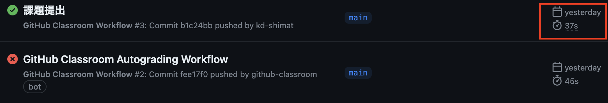
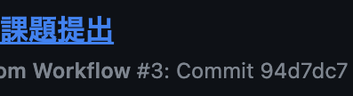
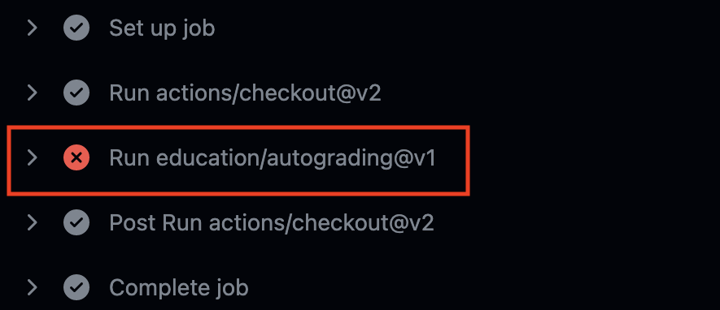
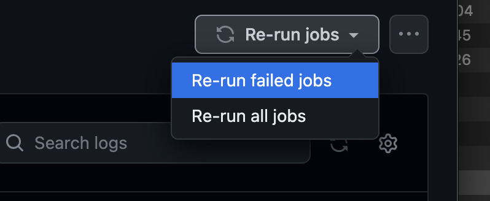

# オブジェクト指向プログラミング

[こちらのページ]()から、ソースコードを`C:¥web_app_dev`へcloneしてください。

## 課題の作成と提出

### 作成したソースコードをpush

pushまでの説明は省略する。忘れた場合は、これより以前の資料を見返し確認すること。

## 採点について

提出した課題はGitHub上で自動採点される。提出後、課題が合格しているかを確認すること。合格していない場合は修正後pushし、再提出すること。

### 課題の合格基準

以下の3つを合格基準とする。

1. obj_update.phpにて、データが正しく更新されること
1. obj_insert.phpにて、データが正しく挿入されること
1. obj_delete.phpにて、データが正しく削除されること

### 合格確認方法

1. 本課題の[課題ページ](https://classroom.github.com/a/mcVSbvMn)に再度アクセスします。
2. 画面上部にある`Actions`をクリックしてください。 

1. **一番上**の行に、緑色のチェックが入っていればOKです。 

### エラーが出た時の対処法

自動採点がエラーになると、**一番上**の行に赤いばつ印がでます。その場合の解決策を以下に示します。

### タイムアウトになっていないかを確認する

※右端の赤枠で囲まれている箇所に処理時間がでますが、**4分前後**かかっている場合には、まずタイムアウトの可能性を疑ってください。

具体的なタイムアウトの確認・解決方法は、

  1. `Actions`のタイトルが以下のようにリンクになっているので、クリック
      
  2. `run-autograding-tests`をクリック
   
  3. 赤いばつ印が出ている箇所をクリック
  
  1. `::error::Setup timed out in XXXXXX milliseconds`のメッセージがあればタイムアウト
   
  6. 解決策としては、右上に`Re-run jobs`(再実行)のボタンがあるので、`Re-run failed jobs`(失敗した処理だけ再実行)をクリックする。
   
  
  7. タイムアウトにならず3分以内に処理が終了したらOK。※タイムアウトでないエラーは、次の解決策を参照。

### プログラムが正確に書かれているか確認する

プログラムが正確に書かれているかを確認してください。たとえ、ブラウザの画面でそれらしく表示されても、自動採点なので融通は効きません。エラーが出た際は、以下の点を確認してください。
