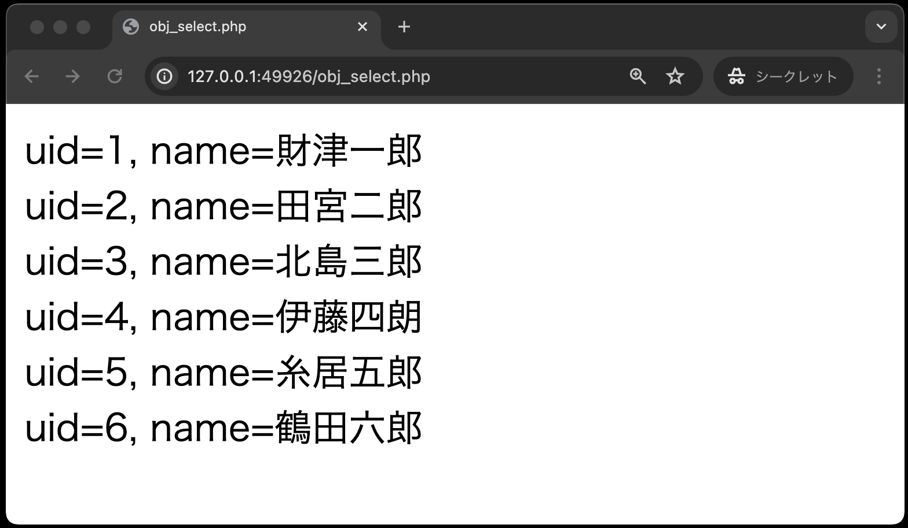
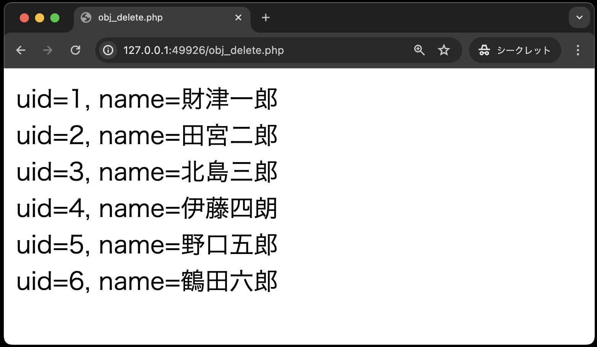
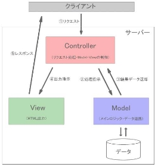
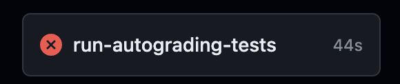

# オブジェクト指向プログラミング

[こちらのページ]()から、ソースコードを`C:¥web_app_dev`へcloneしてください。

### DbPhpクラス

次に、**クラス「DbData」を継承する、クラス「DbPhp」を定義するPHPファイル「dbphp.php」** を作成します。
このクラス「DbPhp」には、次の５つのメソッドを定義します。

① `selectAll( )` メソッド<br>
テーブルpersonのすべてのデータを抽出するメソッド

② `selectPerson( $uid )` メソッド<br>
引数で指定されたユーザーID（$uid）のデータを抽出するメソッド

③ `insertPerson( $name,  $cid,  $age )` メソッド<br>
引数で渡された氏名、カンパニーID、年齢の値で新規ユーザーを登録するメソッド

④ `updatePerson( $uid,  $name )` メソッド <br>
引数で指定されたユーザーID($uid）の氏名を引数で渡された$nameの値に更新するメソッド

⑤ `deletePerson( $name )` メソッド<br>
引数で指定された氏名（$name）のデータを削除するメソッド

`classes/dbphp.php`

```php
<?php
// DbDataクラスを利用するため
// 「DIR」の前後には2本のアンダースコア!!
require_once __DIR__ . '/dbdata.php';

// DBDataクラスを継承したDbPhpクラスの宣言
class DbPhp extends DbData
{
    // ①: テーブルpersonからすべてのデータを抽出する
    public function selectAll()
    {
        $sql = 'SELECT * FROM person';
        // 継承したDBDataクラスのquery( )メソッドを呼び出している
        // SQL文にプレースホルダはないので空の配列を渡している
        $stmt = $this->query($sql, []);
        $persons = $stmt->fetchAll();
        // 抽出した複数のデータを連想配列の形式で戻り値とする
        return $persons;
    }

    // ②:テーブルpersonから指定されたuidのデータを抽出する
    public function selectPerson($uid)
    {
        $sql = 'SELECT * FROM person WHERE uid = ?';
        // 継承したDBDataクラスのquery( )メソッドを呼び出している
        // SQL文のプレースホルダは1つだけだが配列の形式で渡す
        $stmt = $this->query($sql, [$uid]);
        $person = $stmt->fetch();
        // 抽出した1件のデータを連想配列の形式で戻り値とする
        return $person;
    }

    // ③:テーブルpersonに新規ユーザーを登録する
    public function insertPerson($name, $cid, $age)
    {
        $sql = 'INSERT INTO person (name, company_id, age) VALUES (?, ?, ?)';
        // 継承したDBDataクラスのexec( )メソッドを呼び出している
        // SQL文のプレースホルダの数だけ配列で渡す
        $this->exec($sql, [$name, $cid, $age]);
    }

    // ④:テーブルpersonのuidを指定し、氏名の値を更新する
    public function updatePerson($uid, $name)
    {
        $sql = 'UPDATE person SET name = ? WHERE uid = ?';
        // 継承したDBDataクラスのexec( )メソッドを呼び出している
        // SQL文のプレースホルダの数だけ配列で渡す
        $this->exec($sql, [$name, $uid]);
    }

    // ⑤:テーブルpersonの氏名を指定し、データを削除する
    public function deletePerson($name)
    {
        $sql = 'DELETE FROM person WHERE name = ?';
        // 継承したDBDataクラスのexec( )メソッドを呼び出している
        // SQL文のプレースホルダは1つだけだが配列の形式で渡す
        $this->exec($sql, [$name]);
    }
}
```

`class DbPhp extends DbData {`

これにより`DbData`クラスで宣言した `$pdo` プロパティ、`query( )` メソッド、`exec( )` メソッドをこのクラスが利用できます。

なお、dbdata.php同様、ファイル内の言語がphpのみの場合、最後の `?>` の記述は不要です。

**dbdata.php, dbphp.phpのプログラムを作成しても、ブラウザ上での動作確認はまだできません。またGitHubにもpushはしないでください。動作確認、およびGitHubへのpushは、次章の「オブジェクト指向プログラミング②」にあるプログラムを作成する必要があります。**

## 付録: `require_once`とマジック定数 `__DIR__`

開発の規模が大きくなり、全体のコード量が膨大になると、それぞれのファイルに同じコードを記述するのは 非効率かつ保守性に問題がああります。
そこで、`require_once`を使い、共通的な処理を記述しているファイルを読み込むことで、効率化・保守性の向上を図る。

前述の「dbphp.php」では、次のように記述されている。

```php
require_once  __DIR__ . '/dbdata.php'; // 【注】__DIR__の「__」部分はアンダースコア2本!!
```

読み込むファイル名は絶対パスでも相対パスでもよいのだが、`__DIR__` を用いて絶対パスで指定します。
`__DIR__` はPHPのマジック定数（PHPの定義済み定数）の１つで、そのファイルの存在するディレクトリを返します。
なお、`__DIR__` の「`__`」部分はアンダースコア（ `_`）を２つ連続して記述するので注意してください。

[【参考ページ】PHPのマジック定数](http://php.net/manual/ja/language.constants.predefined.php)

ファイルを読み込む方法として他にも `require`、`include_once`、`include`などもありますが、下記の参考サイトで その違いなどを確認しておいてください。

[PHP requireとrequire_onceの違い](https://zeropuro.com/blog/?p=322)<br>
[PHP requireとincludeの違い](https://zeropuro.com/blog/?p=328)

|命令|特徴|
| - | - |
|require|指定されたファイルを何度でも読み込む。読み込めない場合、エラーとなる|
|require\_once|指定されたファイルを一度だけ読み込む。読み込めない場合、エラーとなる。|
|include|指定されたファイルを何度でも読み込む。読み込めない場合、警告となる|
|include\_once|指定されたファイルを一度だけ読み込む。読み込めない場合、警告となる。|

前章で作成したクラス`DbPhp`を利用するphpファイルのコードを以下に示します。

以下の5つのソースコード(`obj_select.php`, `obj_update.php`, `obj_insert.php`, `obj_delete.php`, `obj_select1.php`)は、`public`ディレクトリ直下に作成してください。

### SELECT文

`obj_select.php`

```php
<!DOCTYPE html>
<html lang="ja">

<head>
    <meta charset="UTF-8">
    <meta name="viewport" content="width=device-width, initial-scale=1.0">
    <title>obj_select.php</title>
</head>

<body>
    <?php
    // DbPhpクラスのオブジェクト生成し、selectAll( )メソッドをよびだす
    require_once __DIR__ . '/classes/dbphp.php'; // ①
    $dbPhp = new DbPhp(); // ②
    $persons = $dbPhp->selectAll(); // ③

    // 抽出した全データを画面表示する
    foreach ($persons as $person) { // ④
        echo 'uid=' . $person['uid'] . ', name=' . $person['name'] . '<br>';
    }
    ?>
</body>

</html>
```

①： `require_once __DIR__ . '/classes/dbphp.php';`<br>
このコードでDbPhp.class が利用できるようになる

②: `$dbPhp = new DbPhp( );`<br>
DbPhpクラスのオブジェクトを生成し、変数 `$dbPhp` に格納する

③: `$persons = $dbPhp->selectAll( );`<br>
DbPhpオブジェクトの `selectAll( )` メソッドを呼び出し、抽出したデータが格納されているPDOオブジェクトを受け取るステートメント

④: `foreach ($persons as $person) {`<br>
受け取ったPDOステートメントオブジェクトから1件ずつデータを取り出している

※なお、今回はデータベースを切断する`$pdo = null;`を記述しないパターンでコードを書いております。明示的に記述がない場合は、PHPスクリプトの終了時に自動的に接
続が閉じられます。



### UPDATE文

以下のコードから穴あきになっています。
先程の`obj_select.php`と同様に、クラス`DbPhp`を利用するコードを完成させてください。

なお、ブラウザ上での動作は[データベース利用](../db-crud/README.md)と同じです。

`obj_update.php`

```php
<!DOCTYPE html>
<html lang="ja">

<head>
    <meta charset="UTF-8">
    <meta name="viewport" content="width=device-width, initial-scale=1.0">
    <title>obj_update.php</title>
</head>

<body>
    <?php
    // DbPhpクラスのオブジェクト生成し、updatePersonメソッドをよびだす
    


    // 登録後の全データを画面表示する
    


    ?>
</body>

</html>
```


### INSERT文

`obj_insert.php`

```php
<!DOCTYPE html>
<html lang="ja">

<head>
    <meta charset="UTF-8">
    <meta name="viewport" content="width=device-width, initial-scale=1.0">
    <title>obj_insert.php</title>
</head>

<body>
    <?php
    // DbPhpクラスのオブジェクト生成し、insertPersonメソッドをよびだす
    // name = 深沢七郎, company_id = 3, age = 29
    


    // 登録後の全データを画面表示する
    


    ?>
</body>

</html>
```


### DELETE文

`obj_delete.php`

```php
<!DOCTYPE html>
<html lang="ja">

<head>
    <meta charset="UTF-8">
    <meta name="viewport" content="width=device-width, initial-scale=1.0">
    <title>obj_delete.php</title>
</head>

<body>
    <?php
    // DbPhpクラスのオブジェクト生成し、deletePersonメソッドをよびだす
   


    // 登録後の全データを画面表示する
    


    ?>
</body>

</html>
```



### 条件付きSELECT文にチャレンジ

このチャレンジ問題は自動採点の評価対象外です。
SELECT〜DELETE文を完了した方は、是非チャレンジしてください！

```php
<!DOCTYPE html>
<html lang="ja">

<head>
    <meta charset="UTF-8">
    <meta name="viewport" content="width=device-width, initial-scale=1.0">
    <title>obj_select1.php</title>
</head>

<body>
    <h1>条件付きSELECTの例</h1>
    <?php
    // もしも$_GET['uid']が空なら、uidを求めるフォームを表示(GETメソッド使用)
    if (                   ) {
    ?>
        <!-- 検索フォームを以下に記述 -->


        <!-- ここまで -->
    <?php
    } else {
        // uidをキーにして、GETメソッドで受け取ったuidを代入
        $uid = 

        // DbPhpクラスのオブジェクト生成し、selectPerson( )メソッドをよびだす
        


        // 抽出した結果に応じた画面を表示する
        // 結果が空ならば、該当するユーザがいない旨を表示
        if (           ) {
            echo 
        } else {
            // 結果があれば、uidとnameを表示
            echo 
        }
    }
    ?>
</body>

</html>
```

1. `person`テーブルにデータのあるユーザーIDを入力し、「検索」ボタンを押した時<br>
→該当する`uid`と`name`が表示される


1. `person`テーブルにデータのないユーザーIDを入力し、「検索」ボタンを押した時<br>
→該当するデータが無い旨のメッセージが表示される


1. ユーザーIDを入力せず、「検索」ボタンを押した時<br>
→検索フォームが表示のまま


## 【まとめ】オブジェクト指向プログラミングのメリット

オブジェクト指向プログラミングのメリットは、**複雑なロジック部分のコードを分離することができる** というところです。

さらに、PHPのコードを排除した画面用のコードを作成することも可能となります。
こうして、プログラマーとデザイナーの役割に応じて開発を同時に進めていくことができるようになります。

現状では、こうしたWebアプリケーションの開発で「**MVCモデル**」というデザインパターンがよく利用されており、「Laravel」や「CakePHP」といったフレームワークにもこの「MVCモデル」の概念が取り入られています。

## 付録: MVCモデル

MVCとはModel・View・Controllerの略で、処理を３つの役割に分割して実装する手法です。<br>



- Controller: クライアントからのリクエストを直接受け取り処理を行う部分で、ModelやViewを「制御」する。
- Model: 処理のメインロジックやデータアクセスを担当する。
- View: 処理結果として画面表示（HTML出力）を担当する。

処理の流れとしては、以下のようになります。
Controllerが最も前面かつ全ての仲介に位置する。

1. Controllerがリクエスト情報を基にModelに処理を依頼
1. Modelはデータと連携して処理を行い、処理結果をControllerに返す
1. Controllerは返ってきた処理結果データをViewに渡す
1. Viewはデータを基にHTML出力処理を行う

## 課題の作成と提出

### 作成したソースコードをpush

pushまでの説明は省略する。忘れた場合は、これより以前の資料を見返し確認すること。

## 採点について

提出した課題はGitHub上で自動採点される。提出後、課題が合格しているかを確認すること。合格していない場合は修正後pushし、再提出すること。

### 課題の合格基準

以下の3つを合格基準とする。

1. obj_update.phpにて、データが正しく更新されること
1. obj_insert.phpにて、データが正しく挿入されること
1. obj_delete.phpにて、データが正しく削除されること

### 合格確認方法

1. 本課題の[課題ページ](https://classroom.github.com/a/mcVSbvMn)に再度アクセスします。
2. 画面上部にある`Actions`をクリックしてください。<br>

1. **一番上**の行に、緑色のチェックが入っていればOKです。<br>


### エラーが出た時の対処法

自動採点がエラーになると、**一番上**の行に赤いばつ印がでます。その場合の解決策を以下に示します。

### タイムアウトになっていないかを確認する

※右端の赤枠で囲まれている箇所に処理時間がでますが、**4分前後**かかっている場合には、まずタイムアウトの可能性を疑ってください。


具体的なタイムアウトの確認・解決方法は、

  1. `Actions`のタイトルが以下のようにリンクになっているので、クリック
      
  2. `run-autograding-tests`をクリック
   
  3. 赤いばつ印が出ている箇所をクリック
  
  1. `::error::Setup timed out in XXXXXX milliseconds`のメッセージがあればタイムアウト
   
  6. 解決策としては、右上に`Re-run jobs`(再実行)のボタンがあるので、`Re-run failed jobs`(失敗した処理だけ再実行)をクリックする。
  <br>
  
  7. タイムアウトにならず3分以内に処理が終了したらOK。※タイムアウトでないエラーは、次の解決策を参照。

### プログラムが正確に書かれているか確認する

プログラムが正確に書かれているかを確認してください。たとえ、ブラウザの画面でそれらしく表示されても、自動採点なので融通は効きません。エラーが出た際は、以下の点を確認してください。
