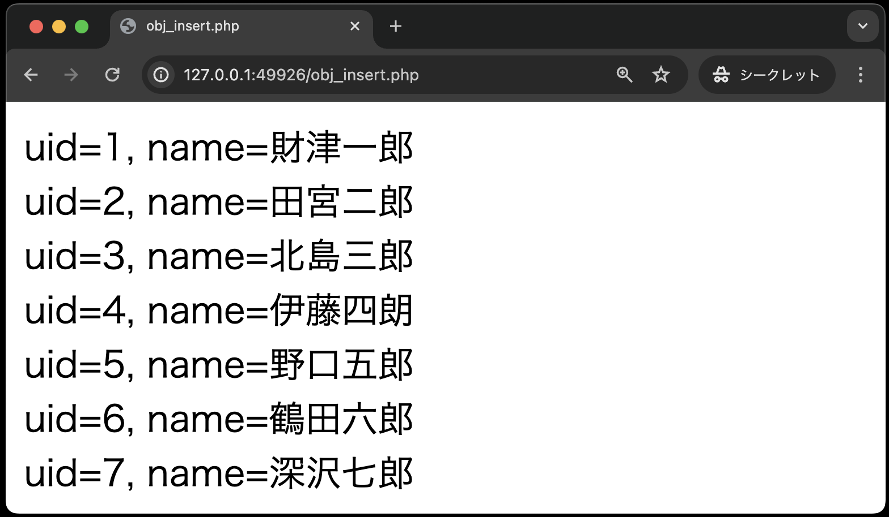
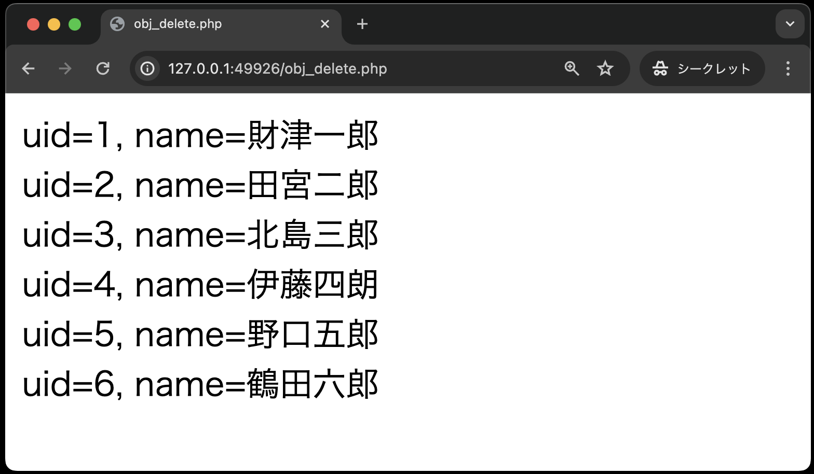

# 作成したクラスの利用②

作成したクラス`DbPhp`を利用するphpファイルのコードを以下に示します。
なお、以下のコードも穴あきですので、穴を埋めてください。

## INSERT文

**obj_insert.php**

```php
<!DOCTYPE html>
<html lang="ja">

<head>
    <meta charset="UTF-8">
    <meta name="viewport" content="width=device-width, initial-scale=1.0">
    <title>obj_insert.php</title>
</head>

<body>
    <?php
    // (穴埋め)DbPhpクラスのオブジェクト生成し、insertPersonメソッドをよびだす
    // name = 深沢七郎, company_id = 3, age = 29
    


    // (穴埋め)登録後の全データを画面表示する
    


    ?>
</body>

</html>
```


## DELETE文

**obj_delete.php**

```php
<!DOCTYPE html>
<html lang="ja">

<head>
    <meta charset="UTF-8">
    <meta name="viewport" content="width=device-width, initial-scale=1.0">
    <title>obj_delete.php</title>
</head>

<body>
    <?php
    // (穴埋め)DbPhpクラスのオブジェクト生成し、deletePersonメソッドをよびだす
   


    // (穴埋め)登録後の全データを画面表示する
    


    ?>
</body>

</html>
```

