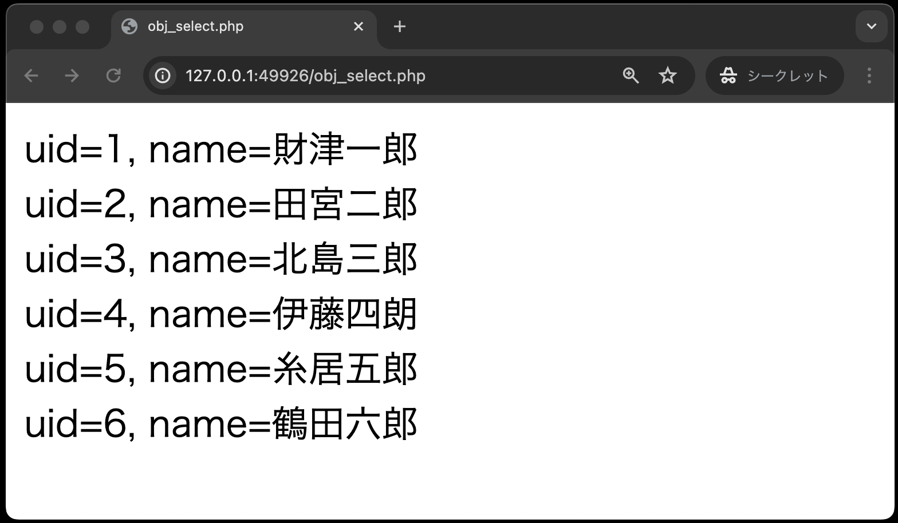
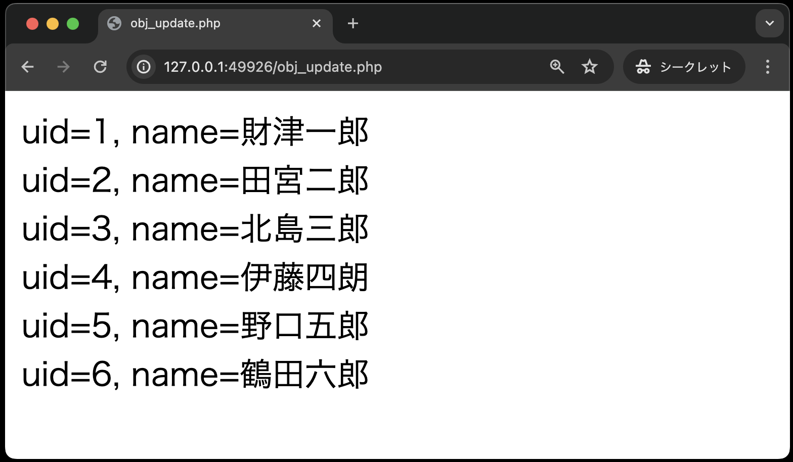

# 作成したクラスの利用①

作成したクラス`DbPhp`を利用するphpファイルのコードを以下に示します。

5つのソースコード(`obj_select.php`, `obj_update.php`, `obj_insert.php`, `obj_delete.php`, `obj_select1.php`)は、`public`ディレクトリ直下に作成してください。

## SELECT文

**obj_select.php**

```php
<!DOCTYPE html>
<html lang="ja">

<head>
    <meta charset="UTF-8">
    <meta name="viewport" content="width=device-width, initial-scale=1.0">
    <title>obj_select.php</title>
</head>

<body>
    <?php
    // DbPhpクラスのオブジェクト生成し、selectAll( )メソッドをよびだす
    require_once __DIR__ . '/classes/dbphp.php'; // ①
    $dbPhp = new DbPhp(); // ②
    $persons = $dbPhp->selectAll(); // ③

    // 抽出した全データを画面表示する
    foreach ($persons as $person) { // ④
        echo 'uid=' . $person['uid'] . ', name=' . $person['name'] . '<br>';
    }
    ?>
</body>

</html>
```

①： `require_once __DIR__ . '/classes/dbphp.php';`<br>
このコードでDbPhp.class が利用できるようになる

②: `$dbPhp = new DbPhp( );`<br>
DbPhpクラスのオブジェクトを生成し、変数 `$dbPhp` に格納する

③: `$persons = $dbPhp->selectAll( );`<br>
DbPhpオブジェクトの `selectAll( )` メソッドを呼び出し、抽出したデータが格納されているPDOオブジェクトを受け取るステートメント

④: `foreach ($persons as $person) {`<br>
受け取ったPDOステートメントオブジェクトから1件ずつデータを取り出している

※なお、今回はデータベースを切断する`$pdo = null;`を記述しないパターンでコードを書いております。
明示的に記述がない場合は、PHPスクリプトの終了時に自動的に接続が閉じられます。



## UPDATE文

以下のコードから穴あきになっています。
先程の`obj_select.php`と同様に、クラス`DbPhp`を利用するコードを完成させてください。

なお、ブラウザ上での動作は[データベース利用](../db-crud/README.md)と同じです。

**obj_update.php**

```php
<!DOCTYPE html>
<html lang="ja">

<head>
    <meta charset="UTF-8">
    <meta name="viewport" content="width=device-width, initial-scale=1.0">
    <title>obj_update.php</title>
</head>

<body>
    <?php
    // (穴埋め)DbPhpクラスのオブジェクト生成し、updatePersonメソッドをよびだす
    


    // (穴埋め)登録後の全データを画面表示する
    


    ?>
</body>

</html>
```

